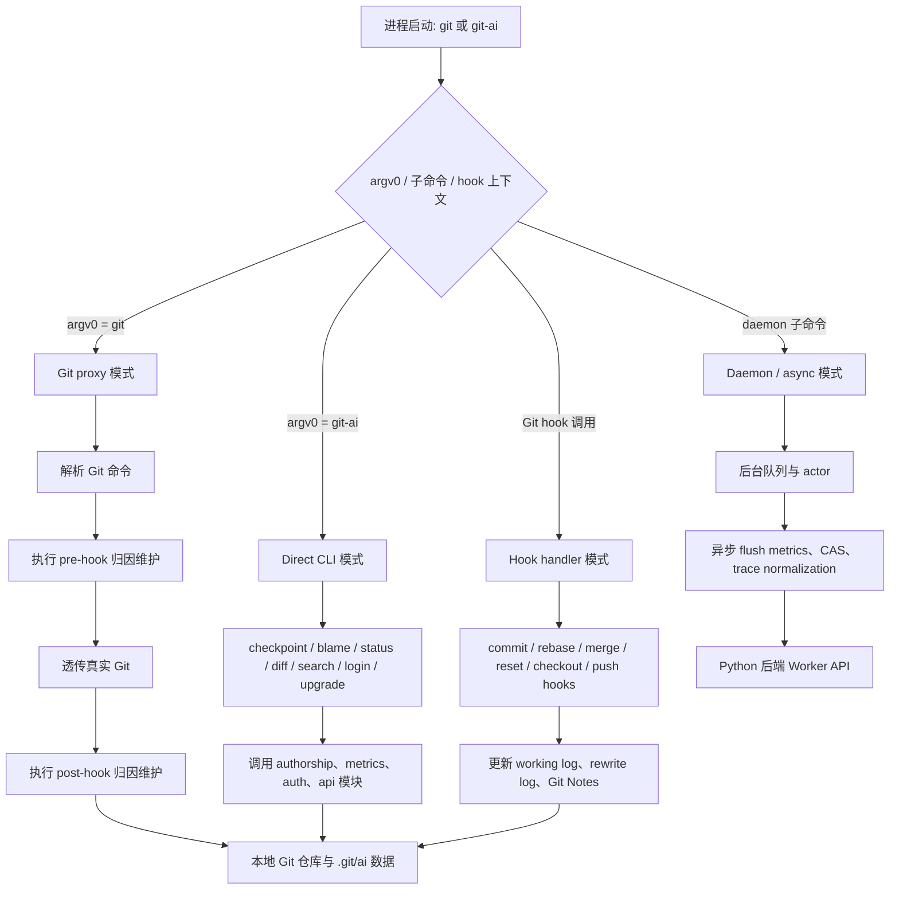
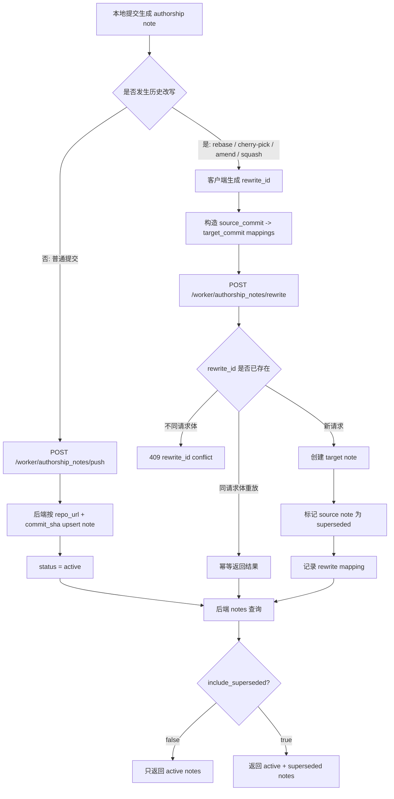

# Python 项目与 git-ai 工程设计文档

日期：2026-06-26  
文档类型：Engineering Design  
目标读者：研发团队、技术评审、运维/交付团队  
代码范围：`git-ai-code-metrics` Python 后端与内嵌 `git-ai` Rust 客户端  
明确排除：前端页面设计、UI 交互细节、前端构建流程

## 1. 文档目标

本文档描述 Python 统计平台与 `git-ai` 客户端之间的工程设计。它既用于研发理解模块边界和落地方式，也用于技术评审判断架构取舍，还用于运维交接时理解部署、配置、数据流和故障定位入口。

系统由两部分组成：

1. Python 后端统计平台：基于 Flask、SQLAlchemy、APScheduler，负责接收 `git-ai` 客户端上传的数据，持久化 metrics、authorship notes、CAS、OAuth、release 等信息，并通过定时任务生成统计结果。
2. `git-ai` Rust 客户端：作为 Git 扩展和 Git 代理运行，负责记录 AI Agent 写代码过程、生成 authorship log、写入 Git Notes，并把 metrics 与 notes 同步到后端。

本文档回答四类问题：

- 系统由哪些模块组成，职责边界是什么。
- `git-ai` 与 Python 后端如何通过 API、Git Notes 和数据库协同。
- 核心数据如何产生、上传、处理、聚合和查询。
- 系统如何部署、运维、测试，以及主要风险是什么。

## 2. 文档组织方案

本次 ED 文档有三种可选组织方式：

| 方案 | 结构 | 优点 | 缺点 | 适用场景 |
|------|------|------|------|----------|
| 模块说明型 | 按 Python 后端、git-ai 客户端、数据库、API 分章 | 研发查代码最快 | 容易割裂端到端数据流 | 纯研发交接 |
| 流程驱动型 | 按 metrics、notes、blame、release 等业务流分章 | 评审和运维容易理解系统运行 | 模块索引不够集中 | 运维排障、架构评审 |
| 综合型 | 先讲上下文和边界，再讲模块，最后讲核心流程、运维和风险 | 同时适配研发、评审和运维 | 文档略长 | 当前项目的综合 ED 文档 |

采用第三种综合型方案。原因是当前系统横跨 Python 后端、Rust 客户端、数据库、Git Notes、定时任务和运维配置，单纯按模块或流程组织都容易遗漏边界。综合型文档先建立整体上下文，再给研发需要的模块映射，最后补齐评审和运维需要的数据流、部署、安全、测试与风险。

## 3. 背景与非目标

### 3.1 背景

团队使用 Claude Code、Cursor、Copilot、OpenCode 等 AI 编码工具后，需要知道代码库中有多少代码来自 AI、哪些仓库和贡献者的 AI 使用比例更高、AI 代码在长期维护中如何演变。`git-ai` 负责在开发者本地捕获 AI 代码归因，Python 后端负责集中存储、聚合和查询这些数据。

核心问题是：Git 提交本身不包含“这一行是否由 AI 生成”的可靠元数据，因此系统不能仅依赖 commit message 或普通 diff 推断。`git-ai` 通过 checkpoint、working log、authorship log 和 Git Notes 把归因数据附加到 Git 历史旁边；后端只消费这些数据，不自行猜测 AI 归因。

### 3.2 目标

- 接收并存储 `git-ai` 上传的 metrics 原始事件。
- 异步解析 metrics raw payload，拆分 committed、checkpoint、agent usage、install hooks 等事件。
- 保存 authorship notes，并支持单条、批量、增量、搜索和历史改写 rewrite 同步。
- 基于 committed events、仓库维度和贡献者维度生成每日聚合统计。
- 基于 Git blame 与 authorship notes 统计仓库当前代码的 AI 归因占比。
- 支持 OAuth 设备授权、CAS 内容存储、Git-AI release 管理和内部升级下载。
- 支持 Codeup merge webhook 后的 authorship notes 补偿。
- 为研发、评审和运维提供清晰的模块边界、数据流、测试和排障入口。

### 3.3 非目标

- 不设计前端 UI、路由、样式或交互。
- 不让后端推断代码是否 AI 生成，后端只消费 `git-ai` 产生的归因数据。
- 不要求后端直接修改业务仓库提交历史。
- 不替代 Git AI Standard，后端遵循并存储标准化 authorship log。
- 不在本文档中定义所有接口字段的完整 OpenAPI 细节，接口字段以 `docs/git-ai-api-reference.md` 与 `docs/swagger/api/` 为准。

## 4. 系统上下文

```text
AI Agent / IDE
  |  checkpoint hooks / agent integration
  v
git-ai Rust client
  |  git proxy, checkpoint, post-commit hooks
  |  writes authorship log to refs/notes/ai
  |  uploads metrics / notes / CAS / OAuth requests
  v
Python Flask backend
  |  routes -> services -> database adapters
  |  scheduler tasks process raw data and calculate stats
  v
SQL database
  |  metrics, stats, notes, blame, scheduler, releases, system
  v
Admin / API consumers / dashboards / operations
```

系统边界如下：

- `git-ai` 运行在开发者机器或 CI 环境，靠近 Git 仓库和 AI Agent。
- Python 后端运行在内部服务端，暴露 Worker API、统计 API、调度 API、系统管理 API。
- Git 仓库仍是业务代码的事实来源；Git Notes 是归因元数据的 Git 侧存储。
- 数据库是后端聚合、查询、审计和发布物管理的事实来源。

## 5. 技术栈

### 5.1 Python 后端

| 技术 | 用途 |
|------|------|
| Flask | HTTP API、Blueprint 路由、健康检查 |
| SQLAlchemy 2.x | ORM、事务、连接池、数据库适配 |
| APScheduler | 定时任务、任务注册、任务执行历史 |
| PyMySQL / SQLite / PostgreSQL 兼容层 | 本地开发和生产数据库访问 |
| PyJWT | Worker/API 认证令牌处理 |
| cryptography | SSH 私钥加密存储 |
| Flasgger | Swagger/OpenAPI 文档生成 |
| Gunicorn/Gevent | 生产 WSGI 运行 |
| PyYAML/python-dotenv | 配置加载和环境变量替换 |

### 5.2 git-ai 客户端

| 技术 | 用途 |
|------|------|
| Rust | Git-AI CLI、Git 代理、归因计算、API 客户端 |
| Git CLI | 生产 Git 操作后端 |
| SQLite | 客户端本地 metrics/internal db |
| Git Notes | `refs/notes/ai` authorship log 存储 |
| Agent support | Claude Code、Cursor、Copilot、OpenCode、Codex、Gemini 等工具集成 |

## 6. Python 后端工程设计

### 6.1 应用入口

`app.py` 是后端入口，负责：

- 加载 `config.yaml` 和环境变量。
- 初始化日志。
- 注册 API blueprints。
- 初始化 Swagger。
- 根据 `scheduler.enabled` 启动 `AICodeScheduler`。
- 暴露 `/health` 健康检查。
- 在生产模式下通过 Gunicorn/Gevent 运行。

### 6.2 路由层

路由层只处理 HTTP 语义，包括参数读取、认证、状态码、JSON 响应和文件下载。业务规则下沉到 service 层。

| Blueprint | 路径前缀 | 责任 |
|-----------|----------|------|
| `stats_bp` | `/api/stats` | 仓库、贡献者、每日统计、提交事件和聚合查询 |
| `stats_repo_bp` | `/api/stats-repo` | 仓库统计配置、SSH Key、blame 结果、分支配置 |
| `scheduler_bp` | `/api/v1/scheduler` | 任务列表、任务状态、手动触发、执行历史 |
| `metrics_bp` | `/worker/metrics` | `git-ai` metrics 上传 |
| `cas_bp` | `/worker/cas` | CAS 对象上传和读取 |
| `oauth_bp` | `/worker/oauth` | 设备授权、token、install nonce |
| `releases_bp` | `/worker/releases` | Git-AI release 元数据、文件下载、后台管理 |
| `git_notes_rest_bp` | `/worker/notes` | legacy notes REST API |
| `authorship_notes_rest_bp` | `/worker/authorship_notes` | authorship notes 标准 API |
| `codeup_webhook_bp` | `/webhook/codeup` | Codeup merge webhook 入队 |
| `otel_receiver_bp` | `/v1/logs`, `/worker/otel/v1/logs` | OTLP logs 接收 |
| `cx_usage_bp` | `/api/v1/cx-aicode` | CX 命令和 code review 事件接收 |
| `system_bp` | `/api` | 用户、角色、菜单、部门等系统管理 |

### 6.3 服务层

服务层承载业务流程，不直接暴露 HTTP 细节。

| 服务 | 责任 |
|------|------|
| `MetricsService` | 解析 raw metrics payload，拆分并保存事件 |
| `NotesRestService` | authorship notes 的 upsert、push、batch、list、search、rewrite |
| `CasService` | 内容寻址对象保存和读取 |
| `OAuthService` | 设备授权、token 交换、refresh token、install nonce |
| `ReleaseService` | release 上传、激活、下载元数据、SHA256SUMS 生成 |
| `BlameStatsService` | clone/fetch 仓库，执行 git blame，结合 notes 计算 AI 占比 |
| `GitCloneService` | 使用 SSH Key clone 或更新仓库缓存 |
| `SshKeyService` | SSH Key 加密存储、解密读取和仓库绑定 |
| `CodeupWebhookService` | 校验 webhook 并创建异步任务 |
| `CodeupMergeAuthorshipService` | 处理 merge 后归因补偿和 notes 重算 |
| `OtelLogsService` | 处理 OTLP logs 并提取 invocation 统计 |

### 6.4 数据访问层

`core/database/base.py` 提供共享 engine 和 `session_scope()` 事务上下文。各业务数据库类围绕 ORM model 封装查询和写入。

| 数据库类 | 责任 |
|----------|------|
| `MetricsDatabase` | metrics raw、committed、checkpoint、agent usage、install hooks |
| `StatsDatabase` | 仓库、贡献者、repo-contributor link、每日统计和查询 |
| `AuthorshipNotesDatabase` | authorship notes 存储、批量读取、增量同步、rewrite 状态 |
| `BlameStatsDatabase` | 仓库统计配置、分支配置、blame 统计结果 |
| `SchedulerDatabase` | task running、task execution、任务历史 |
| `CodeupMergeAuthorshipDatabase` | Codeup merge authorship 异步任务 |
| `ReleaseDatabase` | Git-AI release 和 artifact BLOB |
| `CasDatabase` | CAS 内容对象 |
| `SystemDatabase` | 用户、角色、菜单、部门 |
| `CxUsageDatabase` | CX command usage 和 code review 事件 |
| `OtelLogsDatabase` | OTLP logs 与 skill invocation 统计 |

### 6.5 调度器

调度器由 APScheduler 驱动，任务通过 `@scheduled` 装饰器注册。启动时 `TaskRegistry` 动态发现任务，`AICodeScheduler` 根据配置注册和运行。

主要任务：

| 任务 | 默认频率 | 责任 |
|------|----------|------|
| `metrics_event_processor` | 每 2 分钟或配置覆盖 | 处理 `metrics_events_raw` 中待解析记录 |
| `daily_aggregation` | 周期执行 | 聚合 committed events 为每日统计 |
| `git_blame_stats` | 周期执行 | clone/fetch 仓库并计算 blame 归因 |
| `codeup_merge_authorship` | 周期执行 | 处理 Codeup merge 后 authorship notes 补偿 |
| `task_cleanup` | 每日 | 清理过期任务执行记录 |

任务设计原则：

- 原始数据先落库，再异步解析，避免上传接口被复杂处理阻塞。
- 每条 raw record 有明确状态，支持失败隔离和重试。
- 任务执行记录写入数据库，供 API 和运维排障查询。
- 任务配置由 `config.yaml` 和环境变量控制，生产环境可调整频率、批大小和超时。

## 7. git-ai 客户端工程设计

### 7.1 项目定位

`git-ai` 是运行在开发者本地的 Git 扩展。它不改变业务提交内容，而是通过 Git 代理、hooks、checkpoint 和 Git Notes 把 AI 代码归因记录在提交旁边。

核心职责：

- 捕获 AI Agent 编辑行为和提示词上下文。
- 将工作区变更转换为 line-level authorship attribution。
- 在 commit 后生成 authorship log 并写入 `refs/notes/ai`。
- 处理 rebase、cherry-pick、amend、merge、reset 等历史操作下的归因迁移。
- 提供 `blame`、`status`、`diff`、`search`、`show` 等查询命令。
- 上传 metrics、CAS、authorship notes，并处理 OAuth 登录和升级。

### 7.2 运行模式

`git-ai` 采用单二进制分发，依据调用方式进入不同模式：

| 模式 | 触发方式 | 责任 |
|------|----------|------|
| `git` proxy 模式 | 二进制以 `git` 名称被调用 | 拦截 Git 命令，执行前后 hook，必要时透传真实 Git |
| `git-ai` CLI 模式 | 用户直接执行 `git-ai ...` | 执行 blame/status/checkpoint/login/upgrade 等命令 |
| hook 模式 | Git hooks 调用内部命令 | 处理 commit、rebase、merge、push、checkout 等归因维护 |
| daemon/async 模式 | 后台进程 | 异步处理重任务、metrics flush、trace normalization |

### 7.3 源码边界

| 目录 | 责任 |
|------|------|
| `src/commands/` | CLI 命令和 Git hook handlers |
| `src/authorship/` | working log、authorship log、归因计算、rebase 归因、stats |
| `src/git/` | Git 命令解析、repo 状态、refs、diff、sync authorship |
| `src/api/` | 后端 API client、metrics、CAS、authorship notes、bundle |
| `src/metrics/` | metrics 事件、位置编码、本地 DB |
| `src/auth/` | OAuth credential、token、identity |
| `src/daemon/` | daemon coordinator、actors、telemetry worker |
| `agent-support/` | VS Code、IntelliJ、OpenCode、Amp、Pi 等 Agent 集成 |
| `tests/integration/` | 端到端 Git 场景和归因回归测试 |

### 7.4 归因数据模型

`git-ai` 的归因链路包含四类数据：

1. Checkpoint：AI Agent 或 hook 在编辑前后记录的操作快照。
2. Working log：本地 `.git/ai/working_logs/` 下的临时归因记录。
3. Authorship log：提交级归因结果，包含文件、行范围、AI/人类来源和 prompt 关联。
4. Git Notes：把 authorship log 写入 `refs/notes/ai`，附加到 commit 上，不改变提交 SHA。

后端只消费 authorship notes 和 metrics，不直接参与客户端本地归因计算。

### 7.5 历史改写处理

历史改写是 `git-ai` 的关键复杂点。rebase、cherry-pick、amend、squash、merge conflict 手工提交等操作可能导致原 commit 被新 commit 替代。如果不处理，旧 notes 会悬挂，新 commit 会丢失 AI 归因。

设计原则：

- 客户端在已知 source commit 到 target commit 映射时，调用后端 rewrite API。
- 后端将 source note 标记为 `superseded`，并为 target commit 创建或更新 note。
- 同一 `rewrite_id` 与同一规范化请求体可安全重放。
- 冲突以结构化 `conflicts` 返回，不用异常覆盖部分成功结果。

### 7.6 git-ai 关键流程图

#### 7.6.1 运行入口与模式分发

`git-ai` 单个二进制承担 Git proxy、direct CLI、hook handler 和 daemon 协调职责。入口层先根据调用名、子命令和 hook 上下文判断运行模式，再把请求分发给命令层、归因层、Git 操作层或 API client。



#### 7.6.2 Checkpoint 到 Commit 归因流程

Checkpoint 是 AI 归因的入口。Agent 集成在工具调用前后或编辑完成时触发 `git-ai checkpoint`，客户端把工作区差异转换成 working log。提交时 post-commit hook 再把 working log 归并为 commit 级 authorship log，并写入 `refs/notes/ai`。

```mermaid
sequenceDiagram
    autonumber
    participant Agent as AI Agent / IDE
    participant CLI as git-ai checkpoint
    participant WL as .git/ai/working_logs
    participant Git as Git Repository
    participant Hook as git-ai post-commit hook
    participant Note as refs/notes/ai
    participant API as Python Worker API

    Agent->>CLI: 编辑前后触发 checkpoint
    CLI->>Git: 读取 worktree diff / index 状态
    CLI->>CLI: 解析 agent、session、prompt、文件行范围
    CLI->>WL: 写入 working log

    Agent->>Git: git add / git commit
    Git->>Hook: 触发 post-commit hook
    Hook->>WL: 读取相关 working logs
    Hook->>Git: 读取 commit diff 与父提交
    Hook->>Hook: 计算 AI / human / mixed line attribution
    Hook->>Note: 写入 authorship log 到 Git Notes
    Hook->>API: 可选上传 metrics 与 authorship notes
    API-->>Hook: 返回上传结果
```

#### 7.6.3 Authorship Notes 同步与历史改写流程

普通提交使用 push/upsert 同步 notes；历史改写使用 rewrite 同步 source commit 到 target commit 的替代关系。后端默认只把 active note 暴露给查询和统计，superseded note 仅用于审计或显式 include 场景。



#### 7.6.4 查询、Blame 与统计链路

`git-ai` 本地命令可以直接读取 Git Notes 做 blame/status/diff/search；Python 后端也会通过定时任务集中 clone/fetch 仓库，结合 authorship notes 做组织级统计。两条链路共享同一份归因语义，但查询位置不同。

```mermaid
flowchart LR
    subgraph Local[开发者本地]
        A[git-ai blame/status/diff/search] --> B[读取本地 Git commit / diff]
        B --> C[读取 refs/notes/ai]
        C --> D[展示行级 AI / human 归因]
    end

    subgraph Backend[Python 后端]
        E[git_blame_stats 调度任务] --> F[GitCloneService clone/fetch]
        F --> G[读取仓库 commit / file / blame]
        G --> H[查询 AuthorshipNotesDatabase]
        H --> I[BlameStatsService 计算 AI/human 行数]
        I --> J[BlameStatsDatabase 保存结果]
        J --> K[/api/stats-repo 查询]
    end

    subgraph Sync[同步边界]
        L[git-ai push/list/batch/search notes API]
    end

    C --> L
    L --> H
```

## 8. 双项目集成设计

### 8.1 职责边界

| 领域 | git-ai 客户端 | Python 后端 |
|------|---------------|-------------|
| AI 归因计算 | 负责 | 不负责 |
| Git Notes 写入 | 负责本地写入 | 负责远端存储和查询 |
| Metrics 采集 | 负责产生和上传 | 负责接收、解析、聚合 |
| OAuth | 负责 CLI 登录流程 | 负责设备码、token、refresh |
| CAS | 负责上传/读取对象 | 负责按 hash 存储对象 |
| Release upgrade | 负责查询、校验和下载 | 负责发布元数据与文件下载 |
| Blame 统计 | 可本地查询 | 负责集中化仓库统计 |
| 运维审计 | 本地日志和 metrics | 数据库、调度任务、API 查询 |

### 8.2 API 集成面

`git-ai` 调用的主要后端 API：

| API | 方向 | 说明 |
|-----|------|------|
| `POST /worker/metrics/upload` | 客户端 -> 后端 | 上传 metrics events |
| `POST /worker/authorship_notes/push` | 客户端 -> 后端 | 批量同步 authorship notes |
| `POST /worker/authorship_notes/get` | 客户端 -> 后端 | 查询单个 commit note |
| `POST /worker/authorship_notes/batch` | 客户端 -> 后端 | 批量查询 notes |
| `POST /worker/authorship_notes/list` | 客户端 -> 后端 | 增量列出 notes |
| `POST /worker/authorship_notes/search` | 客户端 -> 后端 | 搜索 notes |
| `POST /worker/authorship_notes/rewrite` | 客户端 -> 后端 | 历史改写后同步 source/target 映射 |
| `POST /worker/cas/upload` | 客户端 -> 后端 | 上传 CAS 对象 |
| `GET /worker/cas/` | 客户端 -> 后端 | 按 hash 读取 CAS 对象 |
| `POST /worker/oauth/device/code` | 客户端 -> 后端 | 获取设备授权码 |
| `POST /worker/oauth/token` | 客户端 -> 后端 | 交换或刷新 token |
| `GET /worker/releases` | 客户端 -> 后端 | 获取 release channel 元数据 |
| `GET /worker/releases/{channel}/download/{filename}` | 客户端 -> 后端 | 下载校验文件、安装脚本和二进制 |

### 8.3 数据契约

集成契约遵循以下规则：

- `repo_url` 进入后端前需要规范化，避免同一仓库因 SSH/HTTPS 或尾部 `.git` 差异重复统计。
- `commit_sha` 使用完整 SHA 存储，展示层可以截断。
- Authorship note 内容以客户端生成的 log 为准，后端不修改内部语义。
- Metrics raw payload 先原样落库，解析失败保留错误信息，便于协议演进排查。
- Rewrite 请求用 `rewrite_id + request_hash` 保证幂等。
- Release 下载用 SHA-256 校验，`SHA256SUMS` 自身 checksum 作为 channel 元数据返回。

## 9. 核心数据流

### 9.1 Metrics 上传与聚合

```text
git-ai client
  -> POST /worker/metrics/upload
  -> MetricsDatabase.save_raw()
  -> metrics_event_processor task
  -> MetricsService.process_raw_event()
  -> committed/checkpoint/agent_usage/install_hooks tables
  -> daily_aggregation task
  -> daily stats / repo stats / contributor stats
  -> stats APIs
```

关键设计：

- 上传接口只做轻量校验和 raw 落库。
- raw 解析由调度任务批处理，避免客户端上传被后端解析复杂度拖慢。
- 解析成功和失败都记录状态，失败数据保留以便重放或排查。
- 聚合任务从结构化事件表生成统计表，查询 API 不直接扫 raw payload。

### 9.2 Authorship Notes 同步

```text
git commit
  -> git-ai post-commit hook
  -> generate authorship log
  -> git notes --ref=ai add <commit>
  -> POST /worker/authorship_notes/push
  -> AuthorshipNotesDatabase upsert
  -> git-ai blame/status or backend blame stats query notes
```

关键设计：

- Git Notes 是 Git 侧事实来源，后端 notes 表是集中查询和同步缓存。
- 普通提交使用 push/upsert。
- 历史改写使用 rewrite，确保 source note 被 supersede，target note 被创建或更新。
- 默认查询排除 superseded notes；审计场景可显式 include。

### 9.3 Git Blame 统计

```text
scheduler git_blame_stats
  -> read repo branch configs
  -> GitCloneService clone/fetch repository
  -> run git blame / inspect files
  -> read authorship notes
  -> BlameStatsService calculate AI/human lines
  -> BlameStatsDatabase save results
  -> stats-repo APIs expose results
```

关键设计：

- 仓库拉取使用配置的 SSH Key，私钥加密存储。
- blame 任务使用本地仓库缓存，避免每次全量 clone。
- 文件过滤、分支配置和仓库启用状态由数据库/配置控制。
- blame 结果持久化，查询 API 读取统计结果而不是实时执行 Git。

### 9.4 Codeup Merge 补偿

```text
Codeup webhook
  -> /webhook/codeup/merge
  -> CodeupWebhookService enqueue task
  -> codeup_merge_authorship scheduler task
  -> fetch source/target repo and notes
  -> classify merge event
  -> MergeAuthorshipCalculator calculate merged note
  -> upsert authorship notes
```

该流程用于补偿平台合并操作导致的 authorship notes 丢失或不完整问题。它不替代客户端归因，而是在明确 merge 上下文下重建合并提交的归因 note。

### 9.5 OAuth、CAS 与 Release

OAuth 负责让 `git-ai` 在无需长期暴露 API Key 的情况下获得访问凭证。CAS 用于按内容 hash 存储对象，减少重复传输并支持后续 bundle/大对象扩展。Release 管理用于内部发布 `git-ai` 客户端版本，后端保存 artifacts，客户端通过 upgrade 流程下载并校验。

## 10. 数据模型设计

### 10.1 Metrics 相关表

| 表 | 说明 |
|----|------|
| `metrics_events_raw` | 原始上传 payload 和解析状态 |
| `metrics_committed` | commit 事件、行数、AI 接受信息、repo/contributor 维度键 |
| `metrics_checkpoint` | checkpoint 事件 |
| `metrics_agent_usage` | Agent 使用事件 |
| `metrics_install_hooks` | hooks 安装事件 |
| `metrics_daily_stat` | 每日聚合统计 |

### 10.2 统计维度表

| 表 | 说明 |
|----|------|
| repositories | 仓库维度、名称层级、统计启用状态 |
| contributors | 贡献者维度 |
| repo_contributor links | 仓库与贡献者关系 |
| repo branch configs | 仓库分支统计配置 |

### 10.3 Authorship、Blame、CAS、Release 表

| 表 | 说明 |
|----|------|
| authorship notes | commit 级 authorship note 内容、状态、hash、时间戳 |
| rewrite records / mappings | 历史改写请求和 source-target 映射 |
| blame stats | 仓库/分支/贡献者维度的 blame 统计结果 |
| CAS objects | 内容寻址对象 |
| git_ai_releases | release channel、tag、状态、校验信息 |
| git_ai_release_artifacts | release 文件内容、SHA-256、大小、类型 |

### 10.4 运维和系统表

| 表 | 说明 |
|----|------|
| scheduler tasks/executions | 任务运行状态、执行历史、错误信息 |
| codeup merge authorship tasks | Codeup merge 补偿任务 |
| system users/roles/menus/depts | 系统管理 |
| otel logs / cx usage | 辅助观测和命令使用统计 |

## 11. API 设计原则

- Worker API 面向 `git-ai` 客户端，优先保证幂等、重试安全和向后兼容。
- 管理 API 面向内部系统，优先保证可审计、权限控制和清晰错误。
- 统计查询 API 面向前端和数据分析，优先读取聚合结果，避免实时扫描大表。
- JSON 响应保持统一的 `ok/data/error` 风格；下载接口使用标准 HTTP headers。
- 对可重放请求使用客户端生成 ID 或内容 hash，例如 `rewrite_id`、CAS hash、release checksum。
- 对批处理接口返回部分成功和冲突详情，不因单个元素失败丢弃整批结果。

## 12. 配置、部署与运行

### 12.1 关键配置

| 配置域 | 说明 |
|--------|------|
| `database.url` | SQLAlchemy 数据库连接串 |
| `scheduler.enabled` | 是否启动后台调度器 |
| `scheduler.jobs` | 任务启用状态、cron、批大小和超时 |
| `blame_stats` | 仓库缓存目录、SSH Key、文件过滤规则 |
| `git_ai.api_key` | Worker API Key |
| `git_ai.releases` | release 文件大小、通道、数量限制 |
| `codeup_webhook` | webhook 校验、仓库缓存、重试和超时 |
| `otel.receiver` | OTLP 接收开关和请求限制 |
| `logging` | 日志目录、级别、滚动策略 |

### 12.2 本地运行

```bash
python -m venv venv
source venv/bin/activate
pip install -r requirements.txt
python app.py
```

本地可使用 SQLite 或开发数据库。需要检查 `config.yaml` 中数据库连接、scheduler 开关和 `git_ai.api_key`。

### 12.3 生产运行

生产推荐使用：

- Gunicorn + Gevent 运行 Flask 应用。
- MySQL 或 PostgreSQL 持久化数据。
- 独立配置日志目录和保留策略。
- 明确限制上传体大小，尤其是 release artifact 和 CAS。
- 定期备份数据库，release artifacts 存在数据库 BLOB 时尤其重要。
- 为 blame 仓库缓存目录配置容量监控和清理策略。

### 12.4 数据库初始化与迁移

项目包含 `sql/` 下的 MySQL 初始化和迁移脚本。新增字段或表时应同时更新：

- SQLAlchemy ORM model。
- 数据库迁移 SQL。
- 单元测试和集成测试。
- 相关 API 文档或 ED 文档。

## 13. 安全与隐私设计

### 13.1 认证与权限

- Worker API 支持 API Key 和 OAuth Bearer Token。
- OAuth 使用设备授权流程，避免 CLI 直接处理用户名密码。
- Release 管理上传、激活、删除等接口必须走管理权限。
- 系统管理 API 使用登录态/JWT 控制访问。

### 13.2 密钥与敏感数据

- SSH 私钥加密存储，只在 clone/fetch 时解密使用。
- API Key、数据库密码、OAuth secret 通过环境变量或配置注入，不写入代码。
- Authorship logs 可能包含文件路径、prompt hash、agent 信息，应按内部敏感数据处理。
- Metrics 事件不应包含源代码全文；如需传输大对象，应使用 CAS 并按 hash 管理。

### 13.3 Git 操作安全

- 后端执行 Git 操作时使用受控仓库缓存目录。
- 仓库 URL 需要规范化和校验，避免路径穿越和非预期协议。
- Release 下载按 filename basename 查找，不允许路径穿越。
- `git-ai` 客户端不修改业务提交内容，归因信息通过 Git Notes 附加。

## 14. 可观测性与运维排障

### 14.1 观测入口

| 入口 | 用途 |
|------|------|
| `/health` | 服务存活检查 |
| scheduler APIs | 查看任务状态、手动触发、执行历史 |
| 日志目录 | Flask、任务、第三方库日志 |
| `metrics_events_raw` | 排查客户端上传和解析问题 |
| task execution 表 | 排查调度任务失败、耗时、重试 |
| authorship notes 表 | 排查 notes 同步、rewrite、superseded 状态 |
| release 表 | 排查 upgrade 下载和校验问题 |

### 14.2 常见故障定位

| 现象 | 优先检查 |
|------|----------|
| metrics 上传成功但统计没有变化 | `metrics_events_raw.extract` 状态、`metrics_event_processor` 执行历史、daily aggregation 结果 |
| blame 统计为空 | 仓库分支配置、SSH Key、clone/fetch 日志、文件过滤规则、authorship notes 是否存在 |
| 客户端 `git-ai blame` 无归因 | 本地 `refs/notes/ai`、后端 notes get/batch、commit SHA 是否匹配 |
| rewrite 后旧提交仍被统计 | notes 查询是否默认排除 `superseded`、rewrite mapping 是否成功 |
| upgrade 校验失败 | `/worker/releases` checksum、`SHA256SUMS` artifact、二进制 SHA-256、下载响应 headers |
| OAuth 登录卡住 | device code 是否过期、token 接口错误、客户端轮询间隔 |

## 15. 测试策略

### 15.1 Python 后端

测试覆盖层次：

- 数据库单元测试：验证 model、CRUD、事务、幂等和过滤逻辑。
- 服务层单元测试：验证 metrics 解析、notes rewrite、release SHA、OAuth 状态机。
- API 集成测试：验证 Flask route、认证、状态码和响应结构。
- 调度任务测试：验证任务注册、执行状态、raw 处理和聚合输出。
- 回归测试：针对 notes superseded、daily aggregation、repo URL normalization 等历史问题保留用例。

推荐命令：

```bash
pytest
pytest tests/unit/test_database/test_metrics_db.py
pytest tests/integration/test_git_ai_releases_api.py
```

### 15.2 git-ai 客户端

测试覆盖层次：

- Rust 单元测试：归因计算、序列化、配置、API 类型。
- 集成测试：真实 Git 仓库场景下的 commit、rebase、merge、reset、blame。
- Snapshot 测试：稳定 blame/status/stats 输出。
- Agent fixture 测试：Claude Code、Cursor、Copilot、OpenCode、Codex、Gemini 等 transcript 解析。
- 性能测试：checkpoint、commit、blame 和 Git proxy 开销。

推荐命令：

```bash
cd git-ai
cargo test
cargo fmt -- --check
cargo clippy
```

## 16. 关键设计决策

1. 使用 Git Notes 保存 authorship log，而不是修改 commit 内容。这样不改变业务提交 SHA，归因数据可独立同步和审计。
2. 后端不推断 AI 归因，只消费 `git-ai` 产生的数据。这样避免统计口径漂移。
3. Metrics 先 raw 落库，再异步解析。这样上传接口更稳定，也保留协议演进和失败排查能力。
4. Notes rewrite 使用 `rewrite_id + request_hash` 做幂等。这样客户端重试不会重复污染数据，不同请求体冲突可被明确识别。
5. Blame 统计由后端定时任务集中计算。这样前端查询快，运维可以审计任务结果，但需要维护仓库缓存和 SSH Key。
6. Release artifact 存数据库 BLOB。这样内部发布物集中备份和审计，但必须限制文件大小并关注数据库容量。
7. 路由、服务、数据库三层分离。这样 API 语义、业务流程和持久化逻辑可分别测试。

## 17. 风险与改进方向

| 风险 | 影响 | 缓解措施 |
|------|------|----------|
| Authorship note 标准演进 | 老客户端与新后端字段不一致 | raw 内容保留、解析兼容、版本化文档 |
| 历史改写场景复杂 | rebase/merge 后归因可能丢失 | 扩充 rewrite 场景测试和 Git 集成测试 |
| Blame 任务耗时 | 大仓库统计慢或任务堆积 | 仓库缓存、分支配置、批处理、超时和任务状态监控 |
| Release BLOB 增长 | 数据库容量增长 | 文件大小限制、清理 inactive release、数据库备份策略 |
| SSH Key 管理不当 | 仓库访问失败或密钥泄露 | 加密存储、最小权限、定期轮换 |
| Metrics raw 堆积 | 聚合延迟、数据库膨胀 | 监控 raw 状态、失败重试、归档策略 |
| 多数据库兼容差异 | 迁移或 SQL 行为不一致 | ORM 测试 + MySQL 迁移脚本 + 集成测试 |

后续可改进：

- 为 metrics raw 和 task execution 增加更清晰的运维仪表盘。
- 为 rewrite 冲突提供专门审计 API。
- 为 blame 统计增加增量计算和缓存失效策略。
- 将 release artifact 生命周期纳入后台清理策略。
- 增强 repo URL normalization 在不同 Git 平台下的覆盖测试。

## 18. 代码索引

### Python 后端

| 文件/目录 | 说明 |
|-----------|------|
| `app.py` | Flask 入口、Blueprint 注册、scheduler 启动、健康检查 |
| `api/routes/` | HTTP 路由层 |
| `core/services/` | 业务服务层 |
| `core/database/` | SQLAlchemy 数据访问层和 models |
| `core/scheduler/` | APScheduler 封装、任务注册、任务实现 |
| `core/config/` | 配置加载和日志配置 |
| `docs/swagger/api/` | Swagger YAML 定义 |
| `sql/` | 数据库初始化和迁移脚本 |
| `tests/` | Python 单元测试和集成测试 |

### git-ai 客户端

| 文件/目录 | 说明 |
|-----------|------|
| `git-ai/src/main.rs` | CLI 入口 |
| `git-ai/src/commands/` | 命令和 Git hook handlers |
| `git-ai/src/authorship/` | 归因计算和 authorship log |
| `git-ai/src/git/` | Git 操作封装和解析 |
| `git-ai/src/api/` | 后端 API client |
| `git-ai/src/metrics/` | metrics 事件和本地存储 |
| `git-ai/src/auth/` | OAuth 与凭证 |
| `git-ai/src/daemon/` | daemon/async mode |
| `git-ai/agent-support/` | IDE/Agent 集成 |
| `git-ai/tests/integration/` | Git 场景集成测试 |
| `git-ai/specs/git_ai_standard_v3.0.0.md` | Git AI Standard |

## 19. 参考文档

- `README.md`：项目总览、技术栈、快速开始和数据流。
- `README_ZH.md`：中文使用说明。
- `docs/项目设计文档.md`：当前更完整的技术设计长文档。
- `docs/git-ai-api-reference.md`：Git-AI 客户端调用后端的 API 参考。
- `docs/swagger/api/`：后端 Swagger YAML。
- `git-ai/README.md`：Git-AI 客户端安装和使用说明。
- `git-ai/AGENTS.md`：Git-AI 子项目开发约定。
- `git-ai/specs/git_ai_standard_v3.0.0.md`：Git AI Standard。
