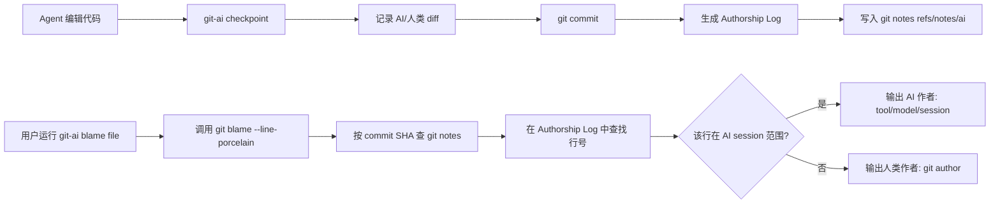

# Git AI Blame 作者归属原理

**git-ai** 的 blame 不是靠“猜测这行像不像 AI 写的”，而是：  

在 AI 写代码时，就通过 agent hook 把“这次改动是哪个 AI、哪个会话写的”记下来，用 git notes 挂到对应 commit 上。  
blame 时，它只是拿标准 `git blame` 的结果，再去查这些 notes，把“这个 commit 的这些行属于哪个 AI session”叠加显示出来。**

下面按流程拆开说。

---

## 1. 核心设计：不“检测 AI”，而是“让 AI 自报家门”

官方文档里有一句很关键的话：

> “Detecting” AI code is an anti-pattern — Git AI does not guess whether a hunk is AI-generated. Supported agents report exactly which lines they wrote.【turn8fetch0】

也就是说，**git-ai 不会事后用启发式规则判断某段代码是不是 AI 写的**，而是：

- 需要支持的 Agent（Cursor、Claude Code、Copilot 等）在写代码时，通过 **钩子主动告诉 git-ai：**
  - “我刚插入的这段代码是 AI 写的”
  - 以及 agent、model、session id 等元信息

---

## 2. 本地如何记录“这行是 AI 写的”

### 2.1 checkpoint：在开发机器上标记 AI/人类改动

在本地开发时，git-ai 会维护一个 **“Authorship Log（归属日志）”**：

1. 你在 Cursor / Claude Code / Copilot 里编辑代码；
2. Agent 配置了 git-ai 的钩子，例如 Claude Code 的 `PreToolUse / PostToolUse` hook，会在写入文件前后调用 `git-ai checkpoint ...`【turn1fetch0】；
3. 每次 checkpoint 记录的是：
   - 当前状态与上一个 checkpoint 之间的 diff；
   - 这个 diff 标记为 **AI authored** 或 **human authored**。

文档里给的例子：在 agent 编辑前后各跑一个 checkpoint：

- **pre-edit checkpoint**：把之前人类改动标记为 human；
- **post-edit checkpoint**：把新插入的 AI 代码标记为 AI。【turn1fetch0】

这些临时 checkpoint 存放在 `.git/ai` 里，直到你做 commit。

### 2.2 commit 时：生成 Authorship Log，挂到 git notes

当你 `git commit` 时，git-ai 会：

1. 把这次提交涉及的所有 checkpoint 压缩成一个 **Authorship Log**，格式类似：

```text
/path/to/file.ts
promptA: 2-24 31-32
promptB: 25-30
/path/to/other/file.ts
promptA: 1-212
```

表示：  
这个文件里，第 2–24、31–32 行来自会话 `promptA`，25–30 行来自会话 `promptB`。【turn2fetch0】

2. 这个 Log 按 **commit SHA** 索引，并通过 **git notes** 挂到这个 commit 上：

```text
Authorship Logs are addressed by commit SHA and should be treated as immutable.
On `post-commit`, each Authorship Log is attached to the new commit using a git note.
```

可以通过：

```bash
git log --show-notes=ai
```

看到类似：

```text
commit 02e97d75fde395576205d18dacf0e51627f356d5
Author: Sasha Varlamov <sasha@sashavarlamov.com>
Date:   Tue Oct 14 18:37:34 2025 -0400

    Filter edited paths/will edit paths to ensure that they are part of the repo

Notes (ai):
    src/commands/checkpoint.rs
    6e4d6f2 51-52,54,58-110,901-931,934-947
    src/git/test_utils/mod.rs
    6e4d6f2 4,410-425
```

notes 的完整格式大致是：

```text
<path>
<session-id> <line-ranges>
---
{
  "schema_version": "authorship/3.0.0",
  "prompts": {
    "<session-id>": {
      "agent_id": {
        "tool": "cursor",
        "model": "sonnet-4.5"
      },
      "human_author": "Jeff Coder <jeff@example.com>",
      "messages_url": "https://your-prompt-store.dev/cas/..."
    }
  }
}
```

这里关键是：

- **按 commit 组织**；
- 每个文件里，**哪些行属于哪个 AI session**；
- 每个 session 里记录了 agent、model、人类作者、消息 URL 等。

---

## 3. blame 时如何把代码归属到 AI / 人类

### 3.1 思路：在 git blame 结果上“叠加” AI notes

文档里对 blame 的描述是：

> `git blame` tracks which commit inserted or last modified each line of code.  
> Since Git AI notes are indexed by commit SHA, AI authorship information can be quickly overlaid on top of git blame.

也就是说：

1. 先跑标准 `git blame --line-porcelain <file>`，拿到：
   - 每一行来自哪个 commit；
   - 原始行号；
2. 用这个 commit SHA 去 **查 git notes**，拿到该 commit 的 Authorship Log；
3. 在 Log 里查：该文件的这行是否在某个 AI session 的行范围内：
   - 在 -> 标记为 AI，并带上 agent/model/session；
   - 不在 -> 标记为 human（或者显示 git 作者）。

所以 **“这行是不是 AI 写的”本质上就是查表：  
这行所属 commit + 文件 + 行号 -> notes 里的 session 映射。**

### 3.2 CLI 输出示例

在 CLI 参考里，`git-ai blame` 被描述为“drop-in replacement for git blame that shows AI authorship attribution for each line”。  
README 里给了一个 blame 输出示例，作者字段会变成类似：

```text
fe2c4c8 (claude [session_id] 2025-12-02 19:25:13 -0500  138)     // Resolve commits to get from/to SHAs
```

即：原来 git blame 的作者字段被替换成：

- 如果是 AI：显示成 `claude [session_id]` / `cursor` 等工具名；
- 如果是人类：显示 git 作者名。

`git-ai diff` 的输出也类似，每行变化后面带标注：

- `🤖cursor` / `🤖claude` 表示 AI；
- `👤alice` 表示人类；
- `[no-data]` 表示没有 AI 归属数据。

### 3.3 JSON 输出（给 IDE/工具用）

`git-ai blame --json` 会输出结构化数据，例如：

```json
{
  "lines": {
    "1": "66392557c1f4b03f",
    "253-259": "66392557c1f4b03f",
    "279-284": "0e120135345341dd"
  },
  "prompts": {
    "66392557c1f4b03f": {
      "agent_id": {
        "tool": "cursor",
        "id": "a48660d5-a9c6-43b6-856c-058424e5516a",
        "model": "claude-4.5-opus-high-thinking"
      },
      "human_author": "Aidan Lastname <email@example.com>",
      "messages": [ ... ],
      "total_additions": 375,
      "accepted_lines": 304
    }
  }
}
```

IDE 插件就用这个数据在编辑器里做颜色标记、悬浮提示等。

---

## 4. 整体流程示意

用一个简单流程图总结一下：



---

## 5. 小结

- **git-ai 的 blame 不靠“猜”，靠“记”**：  
  Agent 写代码时通过钩子主动报告“这是我写的”，git-ai 把这些信息按 commit + 文件 + 行号存进 git notes。
- **blame 时只是叠加查询**：  
  用标准 git blame 拿到“这行来自哪个 commit + 原始行号”，再去查 notes，看这行是否在某个 AI session 的行范围内，来决定显示 AI 还是人类作者。
- 这样做的优点：
  - 准确：不依赖风格检测等启发式方法；
  - 可追溯：能看到 agent、model、甚至原始 prompt；
  - git-native：所有信息都放在 git notes 里，跟着仓库走。